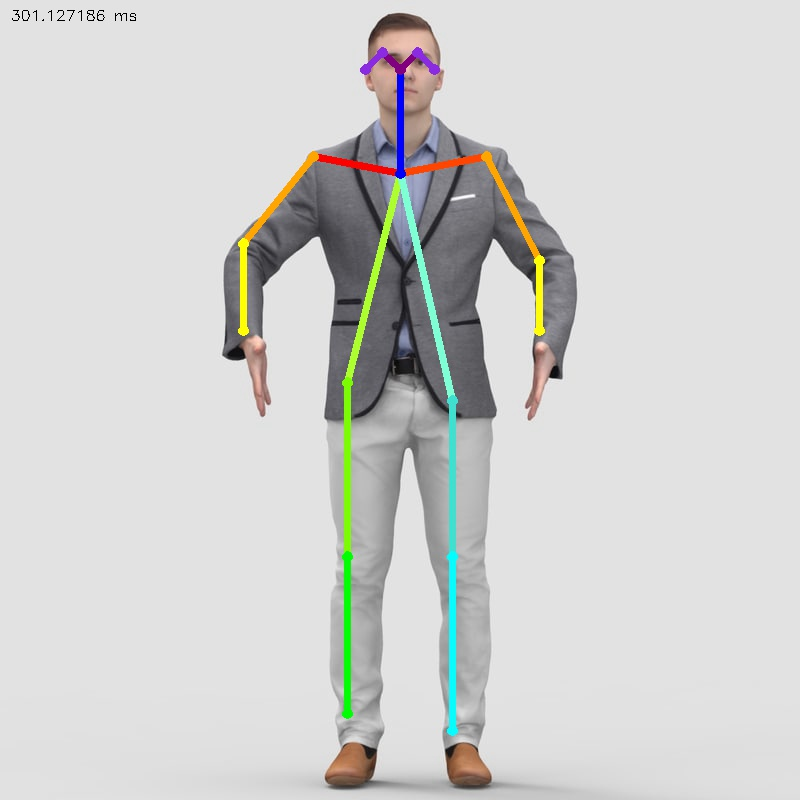

# Pose Estimation in C++ using OpenCV

## Description:

This repository contains a program written in C++ using the OpenCV library which creates a pose estimation output for an image or video of a single person.

## 1) Installation of OpenCV and other libraries needed to compile the code:

1) To install OpenCV using Homebrew on MacOS, open a terminal and paste:

`brew install opencv`

2) Install `pkg-config` which will help insert the correct compiler flags on the command line and find the correct linker flags for OpenCV

`brew install pkg-config`

3) To view the linker flags for OpenCV, execute the following:

`pkg-config --cflags --libs opencv`

4) To compile the code, call:

`make`

## 2) How to call the program using the command line arguments:

To view all the possible option flags for executing the program, run either:

`./main -h`
or
`./main --help`

Note, by default, that any output image will be written to `./outimages/out.jpg`.

### Some examples of calling the program from the command line with inputs:

1) to pass in an input image file named `input.jpg` and output it to a file called `out.jpg`:

`./main -p=input.jpg -o=out.jpg`

2) to open the camera on your local device, don't pass in any file under -p, just leave it blank.

`./main`

3) to set a height of 360 pixels and a width of 240 pixels for your input image (say, `input.jpg`):

`./main -p=input.jpg -u=360 -w=240`

## 3) To terminate the program whilst it is running:

Press `0` on your keyboard.

## 4) Example:

Input image:

Output image:

## 5) Further notes:

The `Tensorflow MobileNet Model` called `graph_opt.pb` was originally posted by the (former) GitHub user `ildoonet` at the (now 404) location [ildoonet/tf-pose-estimation](https://github.com/ildoonet/tf-pose-estimation/tree/master/models/graph/mobilenet_thin).
